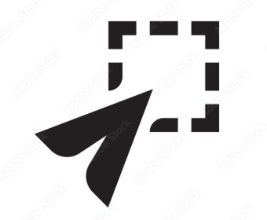

# Maya Rigging Tools 
----------------------------------------

## Tech Stack
 |Toll  | version|
 |----- |--------|
 |python| 3.12   |
 |Maya  |2025+   |

 ------
 ## Set Tracker
 

## What it dose:
A selction tool that helps you have easy access and controler over your customs selection groups.

## How to create a set:
 * Select controls 
 * Type name in the "enter set name bar" 
 * Click “create set” 

## How to delete a set:
  After creating a set, a name box will appear in the existing set portion of the box. using the "X" button you can get rid of any unwanted groups 

  ***Note this will not delete your controls off the model just remove them from the group created ***